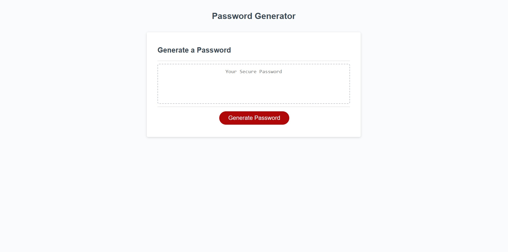

# unique-personal-algorithmic-password-generator

## Description

The motivation behind this project was to practice and implement the basic techniques and methods of JavaScript by creating a password generator that produces a randomly generated password. Specifically, this projects's construction allowed me to practice the use of conditional statements, for-loops, some of the Math.X methods, use of objects and key-value pairs, prompt, confirm and alert methods, pseudo-coding and logical operators among other concepts. In the course of coding this solution I was forced to abandon my original idea as it was overcomplicated and more difficult to implement, instead finding a simpler approach as I went and using that instead. I will try to focus on simplicity first, in the future.

## Table of Contents

- [Description](#description)
- [Usage](#usage)
- [Credits](#credits)
- [License](#license)

## Installation

N/A

## Usage

This application generates passwords based on user input. The user may select a number between 8-128 for the length of the password. 
The user may chose between 4 character sets to be included, e.g. lowercase, uppercase, numeric and special characters. These charactersets may be added to or modified by modifying the character variable for changes in complexity.
The process starts when the user clicks the button. Following this the user is asked to type the length, and select OK or cancel for each character set. The password is then generated according to the users input and returned to the browser.

Screenshot:

## Credits

This project featured the use of starter-code that was not mine. 
The only part of this that I am completely responsible for is the generatePassword function.

## License

Licensed under the MIT license.

